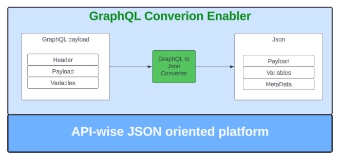

# GraphQL -> JSON conversion
The converter provide the ability to convert GraphQL query/mutation to JSON format, aligned with the idea that the json 
will contains only object fields nor arrays.

## Design in HL

### Black Box


### White Box


## Lets Deep dive into the code interface and usage 
Provide a payloadFacade

```java
public interface PayloadFacade {
  /*
  Load payload and get the @GqlDocument
  use of the @GqlDocument, you can get the json value of the graphql document
   */
  GqlPayload loadPayload(String payload);

  /*
  get query operation tree value map
   */
  Map<String, QueryDefinition> getQueryOperationMap();

  /*
  get canonical path value for graphql fields
   */
  List<String> getValueCanonicalFields(String operationName);
}
```

More info on  GqlPayload :
https://github.intuit.com/fraudprevention/blade-graphql-lib/blob/b64667b3b55e993b2e4d509ecd16c54d73d748e9/src/main/java/com/intuit/library/graphql/model/GqlPayload.java
the payload contains of:
- Variables - taken from the original payload
- Json - this is the graphql representation as json string
- Metadata - metadata over the original graphql payload,  such: number of tken, number of chars, depth of the graphql and path.

### How to get parsed GqlDocument ?

```java

PayloadFacade payloadFacade = new PayloadFacadeImpl();
String fileContent = "query queryName {"+
        "Instrument(id: \"1234\") {"+
        "aliasme: Reference {"+
        "Name"+
        "title"+
        "}"+
        "}"+
        "}\";

GqlPayload rawPayload = payloadFacade.loadPayload(fileContent);
String jsonValue = rawPayload.generateAsJsonObject().toString()

```


```json
{"__operations": {"queryName": {
    "Instrument": {
        "aliasme:Reference": {
            "title": {},
            "Name": {}
        },
        "id<__arg>": {"__value": "1234"}
    },
    "operationType": "QUERY"
}}}
```

## Benchmark Result
https://github.intuit.com/fraudprevention/blade-graphql-lib/blob/b64667b3b55e993b2e4d509ecd16c54d73d748e9/Benchmark-Result/Test%20Results%20-%20DynamicGqlCSVTest_17_7_2023.html


More example:
```
mutation M {
  updateTransactions_TransactionLine(input: {clientMutationId : "0", transactionsTransactionLine : {id : "djQuMTo5MTMwMzUxNzUxNTIwMTI2Ojk3ODhjZjQ3NWI:0-0", account : {id : "djQuMTo5MTMwMzUxNzUxNTIwMTI2OjUxY2VkODUzNmM:143"}, batchUpdateFilters : {batchOperationName : "tickAll", filterProperties : [{name : "manualTxns", value : "false"}, {name : "reconcileStatus", value : "2"}]}}}) {
    clientMutationId
  }
}
```

produce the following json:
```json
{"__operations": {"M": {
    "operationType": "MUTATION",
    "updateTransactions_TransactionLine": {
        "clientMutationId": {},
        "input<__arg>": {
            "__content": {
                "__elem_2": {"transactionsTransactionLine": {
                    "__content": {
                        "__elem_2": {"account": "djQuMTo5MTMwMzUxNzUxNTIwMTI2OjUxY2VkODUzNmM:143"},
                        "__elem_3": {"batchUpdateFilters": {
                            "__content": {
                                "__elem_2": {
                                    "filterProperties": "",
                                    "__content": {
                                        "__elem_2": {
                                            "__content": {
                                                "__elem_2": {"value": "2"},
                                                "__elem_1": {"name": "reconcileStatus"}
                                            },
                                            "__key": ""
                                        },
                                        "__elem_1": {
                                            "__content": {
                                                "__elem_2": {"value": "false"},
                                                "__elem_1": {"name": "manualTxns"}
                                            },
                                            "__key": ""
                                        }
                                    }
                                },
                                "__elem_1": {"batchOperationName": "tickAll"}
                            },
                            "__key": ""
                        }},
                        "__elem_1": {"id": "djQuMTo5MTMwMzUxNzUxNTIwMTI2Ojk3ODhjZjQ3NWI:0-0"}
                    },
                    "__key": ""
                }},
                "__elem_1": {"clientMutationId": "0"}
            },
            "__key": ""
        }
    }
}}}

```

and provide also metadata:

GqlMetaData{path='MUTATION_M', numberOfToken=44, numberOfWhiteSpace=377, maxDepth=2}